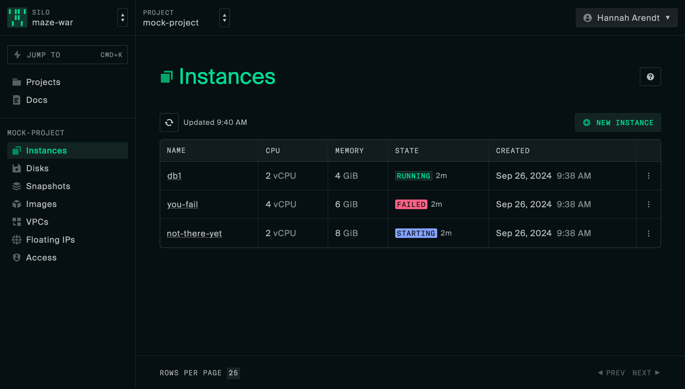
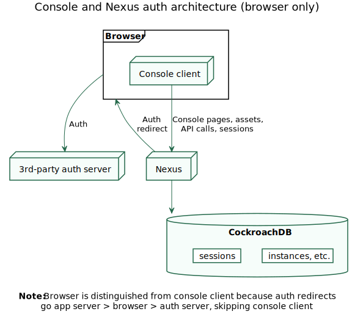

# Oxide Web Console

Web client to the [Oxide API](https://github.com/oxidecomputer/omicron).



## [Live demo](https://oxide-console-preview.vercel.app)

At https://oxide-console-preview.vercel.app the console is deployed as a static site with a mock API running in a [Service Worker](https://developer.mozilla.org/en-US/docs/Web/API/Service_Worker_API). You can create mock resources and they will persist across client-side navigations, but they exist only in the browser: nobody else can see them and the mock "DB" is reset on pageload. Request and response bodies in the mock API match the Oxide API's [OpenAPI spec](https://github.com/oxidecomputer/omicron/blob/main/openapi/nexus.json), but behavior is only mocked in as much detail as is required for development and testing of the console and is not fully representative of the real API.

## Goals and principles

- The console is not an application, it is a _client_ to the application (the Oxide API) — minimize client-side state
- Be a transparent view onto the API — teach API concepts and avoid making the user learn anything console-specific
- Simple, predictable, and broadly functional everywhere is better than deeply polished in a few places
- When we don't have product clarity, build the simplest thing and move on
- There is enough technical risk elsewhere down the stack, so be conservative:
  - Focus on building things we can be sure we'll need
  - Rely on good libraries that we can use the way they want to be used
  - Building on bad abstractions is costly — duplication is fine while you figure out the right abstraction
- Linkability — use routes to capture app state
- Rely on code generated from API spec for correctness

## Architecture



In order to avoid the complexity of server-side rendering (and running JS on the rack), the web console is a fully client-side React app. We use Vite (which uses Rollup internally for production builds) to build a set of assets (`index.html`, JS bundles, CSS, fonts, images) and we serve those assets as static files from a special set of console endpoints in Nexus. From the control plane API server's point of view, the web console simply is:

- a directory of static assets and some endpoints that serve them
- a few other endpoints to handle auth actions like login/logout
- a table of sessions (console-specific in practice, but not intrinsically so)

The web console has no special privileges as an API consumer. Logging in sets a cookie, and we make cookie-authed API requests after that. See [RFD 223 Web Console Architecture](https://rfd.shared.oxide.computer/rfd/0223) (internal document for now) for a more detailed discussion. The endpoints live in [`nexus/src/external_api/console_api.rs`](https://github.com/oxidecomputer/omicron/blob/c3048a1b43b046c284432eba34d0bc1933de4d56/nexus/src/external_api/console_api.rs) in Omicron.

## Tech

- [TypeScript](https://www.typescriptlang.org/) + [React](https://reactjs.org/) (+ [React Router](https://reactrouter.com/), [TanStack Query](https://tanstack.com/query/latest/), [TanStack Table](https://tanstack.com/table/v8/))
- [Vite](https://vitejs.dev/) for dev server and browser bundling
- [Tailwind](https://tailwindcss.com/) for styling
- [oxide.ts](https://github.com/oxidecomputer/oxide.ts) generates an API client from [Nexus's OpenAPI spec](https://github.com/oxidecomputer/omicron/blob/main/openapi/nexus.json)
- Testing
  - [Mock Service Worker](https://mswjs.io/) for mock API server
  - [Vitest](https://vitest.dev/) for unit tests
  - [Playwright](https://playwright.dev/) for E2E browser tests
- [Ladle](https://ladle.dev/), a lightweight Storybook clone based on Vite

## Directory structure

The app is in [`app`](app). You can see the route structure in [`app/routes.tsx`](app/routes.tsx). In [`libs`](libs) we have a [`ui`](libs/ui) dir where the low-level components live and an [`api`](libs/api) dir where we keep the generated API client and a React Query wrapper for it. These directories are aliased in [`tsconfig.json`](tsconfig.json) for easy import from the main app as `@oxide/ui` and `@oxide/api`, respectively.

## Development

### Node.js version

Use Node.js v18+.

### Install dependencies

```sh
npm install
npx playwright install # only needed to run e2e tests
```

### Run Vite dev server + [MSW](https://mswjs.io/) mock API

This is the way we do most console development. Just run:

```
npm run dev
```

and navigate to http://localhost:4000 in the browser. The running app will automatically update when you write a source file. This mode uses Mock Service Worker to run a mock API right the browser. This mock API is also used in tests.

#### Specifying non-default user

Pick a user from the list of users in
[`mock-api/user.ts`](/mock-api/user.ts). The one without fleet
viewer permissions is `Hans Jonas`. Open the browser console and run:

```js
document.cookie = 'msw-user=Hans Jonas;domain=localhost;path=/'
```

You are now user Hans Jonas. To go back to the default, delete the cookie. (We will get the mock API to clear the cookie for you on logout soon.)

### Run Vite dev server against local Nexus API

You can also run the console dev server locally with the mock server off, instead passing requests through to `localhost:12220`. Run `npm run start:nexus` and navigate to http://localhost:4000/login/test-suite-silo/local in the browser. It will not work unless Nexus is running at `localhost:12220`, which is the default for `omicron-dev` (see [Running Omicron (Simulated)](https://github.com/oxidecomputer/omicron/blob/main/docs/how-to-run-simulated.adoc) for how to set that up).

One way to run everything is to use the `tools/start_api.sh` script, which uses tmux to run multiple processes in different panes and automatically populates some fake data (see [`tools/populate_omicron_data.sh`](tools/populate_omicron_data.sh) to see exactly what). From the omicron directory, run `tools/start_api.sh`. Since we're assuming `console` and `omicron` are next to each other, that looks like this:

```sh
../console/tools/start_api.sh
```

<details>
<summary>Configuring tmux</summary

Because running the API requires running two programs plus the populate data script, we use tmux to split the terminal into panes so we can see the log output of all three. tmux has its own complicated set of [keyboard shortcuts](https://tmuxcheatsheet.com/). A good way to avoid having to deal with that if you want to poke around in the server logs is to create `~/.tmux.conf` that looks like this:

```
set -g mouse on
```

This will let you click to focus a pane and scrolling output with the mouse will automatically work. If you do want to use the shortcuts, here's a `tmux.conf` to make it a little more vim-like:

```shell
# change leader key from ctrl-b to ctrl-a
unbind C-b
set-option -g prefix C-a
bind-key C-a send-prefix

# ctrl-a v makes a vertical split, ctrl-a h make a horizontal split
bind v split-window -h
bind s split-window -v
unbind '"'
unbind %

# ctrl-a h/j/k/l move between panes
bind h select-pane -L
bind j select-pane -D
bind k select-pane -U
bind l select-pane -R

set -g mouse on
```

</details>

### Run local dev server against the dogfood rack

1. Get on the VPN
1. Run `npm run start:dogfood`
1. Go to https://localhost:4000 (note the https). The page won't work yet, and you'll get redirected to `/login`, which will look like a 404
1. Go to https://oxide.sys.rack2.eng.oxide.computer in another tab and log in
1. Open the dev tools Storage tab and copy the `session` cookie value, which should look like `d9b1a96e151092eb0ea08b1a0d8c4788441f1894`
1. Go back to your localhost tab, open the developer console, and run

```js
document.cookie = 'session=d9b1a96e151092eb0ea08b1a0d8c4788441f1894;domain=localhost;path=/'
```

Go to https://localhost:4000 again and you should be logged in.

### Run [Ladle](https://ladle.dev/)

```
npm run ladle
```

This will start a preview environment for UI components at `http://localhost:61000`.

### E2E tests with [Playwright](https://playwright.dev/)

Playwright tests live in [`test/e2e`](test/e2e/). `npm run e2e` runs the tests in Chrome, Firefox, and Safari, but this is rarely necessary in local dev. `npm run e2ec` is a shortcut for `playwright test --project=chrome`, which runs the tests in Chrome only (the fastest one, useful for local dev). Playwright has an excellent [UI mode](https://playwright.dev/docs/test-ui-mode) for running and debugging tests that you can get to by running `npm run e2e -- --ui`.

To debug end-to-end failures on CI, check out the branch with the failure and run `./tools/debug-ci-e2e-fail.sh`. It'll download the latest failures from CI and allow you to open a [playwright trace](https://playwright.dev/docs/trace-viewer-intro#viewing-the-trace) of the failure.

### Summary of useful commands

| Command                  | Description                                                                        |
| ------------------------ | ---------------------------------------------------------------------------------- |
| `npm run dev`            | Run Vite dev server with mock API                                                  |
| `npm test`               | Vitest unit tests                                                                  |
| `npm run e2ec`           | Run Playwright E2E tests in Chrome only                                            |
| `npm run lint`           | ESLint                                                                             |
| `npx tsc`                | Check types                                                                        |
| `npm run ci`             | Lint, tests (unit and e2e), and types                                              |
| `npm run ladle`          | Run Ladle (Storybook)                                                              |
| `npm run fmt`            | Format everything. Rarely necessary thanks to editor integration                   |
| `npm run gen-api`        | Generate API client (see [`docs/update-pinned-api.md`](docs/update-pinned-api.md)) |
| `npm run start:mock-api` | Serve mock API on port 12220                                                       |

## Relevant RFDs

- [RFD 4 User-Facing API](https://rfd.shared.oxide.computer/rfd/0004)
- [RFD 169 Console Authentication and Session Management](https://rfd.shared.oxide.computer/rfd/0169)
- [RFD 223 Web Console Architecture](https://rfd.shared.oxide.computer/rfd/0223)
