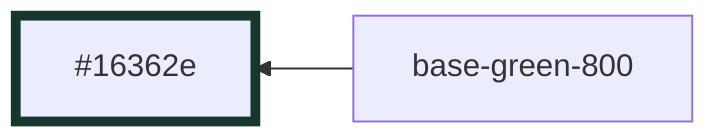
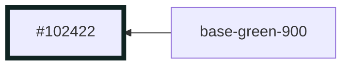
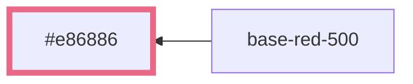
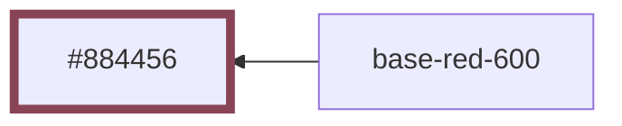
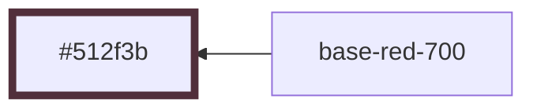
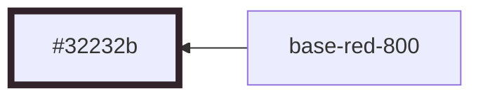
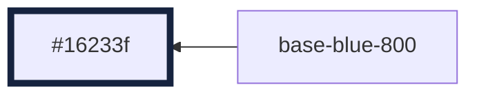
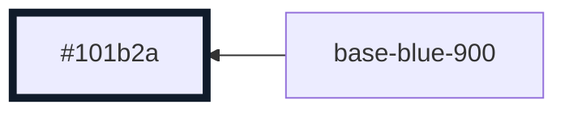

# `operator-mode` Theme

This document shows the relationship of colors within the `main` theme.

## base-green-500


## base-green-600


## base-green-700


## base-green-800



## base-green-900



## base-yellow-500


## base-yellow-600


## base-yellow-700


## base-yellow-800


## base-yellow-900


## base-red-500



## base-red-600



## base-red-700



## base-red-800



## base-red-900


## base-blue-500


## base-blue-600


## base-blue-700


## base-blue-800



## base-blue-900



## base-grey-500

```mermaid
graph RL
  base-grey-500 --> #e7e7e8:::base-grey-500

  classDef base-grey-500 stroke-width:5,stroke:#e7e7e8
```

## base-grey-600

```mermaid
graph RL
  base-grey-600 --> #9ea1a3:::base-grey-600

  classDef base-grey-600 stroke-width:5,stroke:#9ea1a3
```

## base-grey-700

```mermaid
graph RL
  base-grey-700 --> #6c7174:::base-grey-700

  classDef base-grey-700 stroke-width:5,stroke:#6c7174
```

## base-grey-800

```mermaid
graph RL
  base-grey-800 --> #4b5255:::base-grey-800

  classDef base-grey-800 stroke-width:5,stroke:#4b5255
```

## base-grey-900

```mermaid
graph RL
  base-grey-900 --> #353c40:::base-grey-900

  classDef base-grey-900 stroke-width:5,stroke:#353c40
```

## base-grey-1000

```mermaid
graph RL
  base-grey-1000 --> #252d31:::base-grey-1000

  classDef base-grey-1000 stroke-width:5,stroke:#252d31
```

## base-black-500

```mermaid
graph RL
  base-black-500 --> #182024:::base-black-500

  classDef base-black-500 stroke-width:5,stroke:#182024
```

## base-black-600

```mermaid
graph RL
  base-black-600 --> #0b1418:::base-black-600

  classDef base-black-600 stroke-width:5,stroke:#0b1418
```

## base-black-700

```mermaid
graph RL
  base-black-700 --> #080f11:::base-black-700

  classDef base-black-700 stroke-width:5,stroke:#080f11
```
