# `operator-mode` Theme

This document shows the relationship of colors within the `operator-mode` theme.

## base-green-500


## base-green-600


## base-green-700


## base-green-800


## base-green-900


## base-yellow-500


## base-yellow-600


## base-yellow-700


## base-yellow-800

```mermaid
graph RL
  base-yellow-800 --> #343526:::base-yellow-800
  theme-accent-4 --> base-yellow-800
  theme-notice-4 --> base-yellow-800
  chart-fill-item-tertiary --> theme-accent-4
  surface-accent-raise --> theme-accent-4
  surface-accent-secondary-hover --> theme-accent-4
  surface-notice-raise --> theme-notice-4
  surface-notice-secondary-hover --> theme-notice-4
  stroke-accent-tertiary --> theme-accent-4
  stroke-notice-tertiary --> theme-notice-4

  classDef base-yellow-800 stroke-width:5,stroke:#343526
```



## base-yellow-900


## base-red-500


## base-red-600


## base-red-700


## base-red-800


## base-red-900


## base-blue-500


## base-blue-600


## base-blue-700


## base-blue-800


## base-blue-900


## base-grey-500

```mermaid
graph RL
  base-grey-500 --> #e7e7e8:::base-grey-500
  surface-inverse --> content-default
  content-default --> base-grey-500

  classDef base-grey-500 stroke-width:5,stroke:#e7e7e8
```

## base-grey-600

```mermaid
graph RL
  base-grey-600 --> #9ea1a3:::base-grey-600
  surface-inverse-secondary --> content-secondary
  content-secondary --> base-grey-600

  classDef base-grey-600 stroke-width:5,stroke:#9ea1a3
```

## base-grey-700

```mermaid
graph RL
  base-grey-700 --> #6c7174:::base-grey-700
  surface-inverse-tertiary --> content-tertiary
  content-tertiary --> base-grey-700
  stroke-raise --> base-grey-700

  classDef base-grey-700 stroke-width:5,stroke:#6c7174
```

## base-grey-800

```mermaid
graph RL
  base-grey-800 --> #4b5255:::base-grey-800

  classDef base-grey-800 stroke-width:5,stroke:#4b5255
```

## base-grey-900

```mermaid
graph RL
  base-grey-900 --> #353c40:::base-grey-900
  content-quaternary --> base-grey-900
  stroke-default --> base-grey-900

  classDef base-grey-900 stroke-width:5,stroke:#353c40
```

## base-grey-1000

```mermaid
graph RL
  base-grey-1000 --> #252d31:::base-grey-1000
  chart-stroke-item-inactive --> base-grey-1000
  surface-secondary-hover --> base-grey-1000
  stroke-secondary --> base-grey-1000

  classDef base-grey-1000 stroke-width:5,stroke:#252d31
```

## base-black-500

```mermaid
graph RL
  base-black-500 --> #182024:::base-black-500
  surface-secondary --> base-black-500
  surface-disabled --> base-black-500
  content-inverse-secondary --> surface-secondary
  stroke-tertiary --> base-black-500

  classDef base-black-500 stroke-width:5,stroke:#182024
```

## base-black-550

```mermaid
graph RL
  base-black-550 --> #0E1A1F:::base-black-550
  surface-raise-hover --> base-black-550

  classDef base-black-550 stroke-width:5,stroke:#0E1A1F
```

## base-black-600

```mermaid
graph RL
  base-black-600 --> #0b1418:::base-black-600
  chart-fill-inactive --> base-black-600
  surface-raise --> base-black-600

  classDef base-black-600 stroke-width:5,stroke:#0b1418
```

## base-black-700

```mermaid
graph RL
  base-black-700 --> #080f11:::base-black-700
  surface-default --> base-black-700
  content-inverse --> surface-default
  stroke-surface --> surface-default

  classDef base-black-700 stroke-width:5,stroke:#080f11
```
